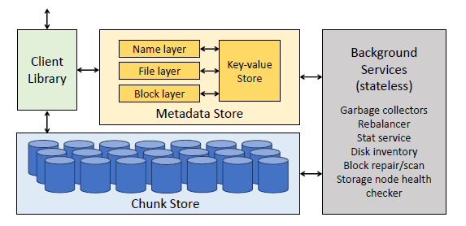
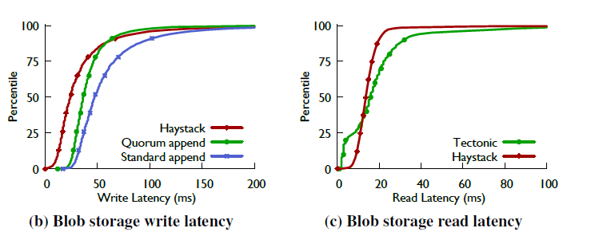

这篇文章介绍了Facebook的分布式文件系统Tectonic。Tectonic是数据中心级的文件系统，支持多租户（multitenant），可以扩展至EB级的存储，实现了多个租户之间的资源高效共享和隔离，提高了集群资源利用率，简化了集群管理复杂度，同时可以获得与单租户专用文件系统相匹配的性能。

## 问题背景

在Tectonic诞生之前，Facebook对不同的租户针对其负载特征和性能需求采用不同的文件系统来保证其性能。例如，Blob storage采用了Haystack和f4来分别存储热数据和冷数据，Data warehouse采用吞吐量较高的HDFS文件系统。多个文件系统增加了集群管理的复杂度，同时难以进行资源共享从而造成空闲资源的浪费，因而需要一个通用的支持多租户的文件系统。

## 主要挑战

实现EB级的多租户文件系统主要存在以下挑战：
- 数据量级大，需要可扩展至EB级
- 多租户之间性能隔离及公平的资源共享
- 针对单个租户的特性做出相应的优化
- 每个租户都为许多不同负载特征和性能需求的应用提供服务

## 解决方法

### Tectonic架构

如上图所示，Tectonic主要包含Chunk Store、Metadata Store、 Client Library以及一些后台的服务。其中Chunk Store可存储的chunk数量随存储节点的增加而线性增长，使得Tectonic可以很容易的扩展至EB级存储。Metadata Store采用分层的元数据组织方式，借助可扩展的ZippyDB进行存储来简化元数据的管理，使Metadata Store可以支持EB级数据的元数据存储和访问，并通过通过哈希分割（Hash partition）来提高元数据的访问性能。

### 多租户

为实现多租户之间的资源共享和隔离，Tectonic将集群的资源分为瞬时（Ephemeral）和非瞬时（Non-ephemeral）两种，然后根据应用对资源、延迟等的需求将同一个租户内的相似应用放在一个Traffic Group内，每个Traffic Group都有其对应的等级，代表该group对延迟的敏感度。最后根据每个group的等级分配相应的资源。

### 针对单租户的优化

为了获得和单租户文件系统相匹配的性能，在Tectonic中，需要根据不同的tenant的特性对其进行优化，如下图所示为对Blob storage和Data warehouse的Append操作进行的优化。

由于Data warehouse更关注吞吐率，所以在内存中将完整的数据块进行RS code写，减小写入磁盘的数据总量，同时提高磁盘性能。而Blob storage对延迟较为敏感吗，因此采用直接多副本写入磁盘的方式来降低相应延迟，即使写入大小未达到一个块大小，也可以进行部分写。

## 实验结果

上图为Blob Storage的latency测试结果，可以看到Tectonic获得了接近单租户文件系统Haystack的延迟。
 
了解更多请关注: [论文原文及ppt](https://www.usenix.org/conference/fast21/presentation/pan) 
